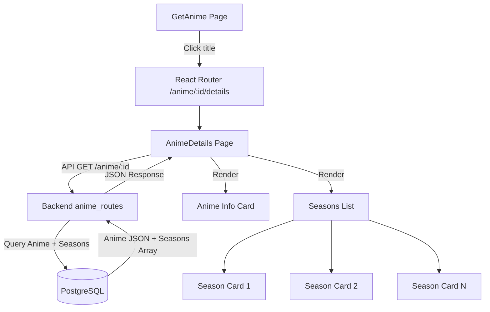

# Design Document

## Overview
This feature adds an anime details page that displays comprehensive information about a selected anime, including its rating and a list of associated seasons with their individual ratings. Users navigate to this page by clicking the anime title on the GetAnime page.

## Steering Document Alignment

### Technical Standards (tech.md)
- Backend: Flask blueprint in `routes/anime.py`, using `make_response` pattern
- Frontend: React functional component with TypeScript interfaces, Material-UI components
- API: Axios from `base.ts` for frontend requests
- Routing: React Router v6 with dynamic route `/anime/:id/details`
- Auth: Protected by `AuthRoute` wrapper (consistent with other authenticated pages)

### Project Structure (structure.md)
- New page component: `oat-frontend/src/Pages/AnimeDetails.tsx`
- New frontend model: `oat-frontend/src/Models/season.ts`
- New frontend API function: `oat-frontend/src/BackendRequests/anime.ts` (append existing)
- New backend route: `routes/anime.py` (append existing)
- Route registration: `oat-frontend/src/App.tsx` (add route)

## Code Reuse Analysis

### Existing Components to Leverage
- **`oat-frontend/src/Pages/GetAnime.tsx`**: Card component pattern, loading/error states, auth guard pattern
- **`oat-frontend/src/BackendRequests/anime.ts`**: Add new `animeGetByIdWithSeasons` function following existing `animeGet`/`animeSearch` patterns
- **`oat-frontend/src/BackendRequests/base.ts`**: Axios instance for API calls
- **`oat-frontend/src/Models/anime.ts`**: Extend anime model pattern for new types
- **`oat-frontend/src/TextFormating/text_config.ts`**: Shared text style exports (h1, h2, h4)
- **`routes/anime.py`**: Existing blueprint and route pattern for adding new `/anime/:id` endpoint
- **`db_models/anime.py`**: `make_json()` method pattern, `Anime` model
- **`db_models/seasons.py`**: `Seasons` model with fields: `season_number`, `title`, `episodes`, `desc`, `rating`, `air_date`, `end_date`, `type_season`, `part`

### Integration Points
- **Backend `/anime/:id` endpoint**: New endpoint in `routes/anime.py` that queries anime by ID and joins seasons
- **Frontend React Router**: Add new route in `App.tsx` matching pattern of existing authenticated routes
- **GetAnime page**: Modify to add `Link` wrapping the title, using `react-router-dom`

## Architecture



### Modular Design Principles
- **Separation of concerns**: Frontend page handles UI, backend route handles data fetching
- **Single responsibility**: Each component has one clear purpose
- **Interface consistency**: New API follows existing response format with `make_json()` pattern

## Components and Interfaces

### Component 1: Backend Route - Get Anime by ID with Seasons
- **Purpose:** Fetch anime by ID along with all associated seasons
- **Interface:** `GET /anime/:id`
- **Response:** `{ "anime": <anime_json>, "seasons": [<season_json>, ...] }`
- **Dependencies:** `db_models.anime.Anime`, `db_models.seasons.Seasons`, SQLAlchemy session
- **Reuses:** `routes/anime.py` blueprint `anime_routes`

### Component 2: Frontend Page - AnimeDetails
- **Purpose:** Display anime details and seasons list
- **Interfaces:**
  - `AnimeDetails` — Main page component
  - `AnimeDetailCard` — Section showing main anime info
  - `SeasonsSection` — Section listing all seasons
  - `SeasonCard` — Individual season display card
- **Dependencies:** React Router params, axios API call, auth context
- **Reuses:** `@mui/material` Card, Typography, Box components (same as GetAnime)

### Component 3: Frontend API Function
- **Purpose:** Fetch anime with seasons from backend
- **Interface:** `animeGetByIdWithSeasons(id: number): Promise<{anime: any, seasons: any[]}>`
- **Reuses:** `oat-frontend/src/BackendRequests/base.ts` axios instance

### Component 4: Frontend Season Model
- **Purpose:** TypeScript interface for season data
- **Fields:** `id`, `season_number`, `title`, `episodes`, `desc`, `rating`, `air_date`, `end_date`, `type_season`, `part`, `anime_id`

## Data Models

### Backend Response Structure
```json
{
  "anime": {
    "id": 1,
    "title": "Example Anime",
    "jp_title": "例のアニメ",
    "_type": "show",
    "rating": 4.5,
    "episodes": 24,
    "desc": "Description text",
    "content_rating": "PG-13",
    "nsfw": false,
    "seasons": 1,
    "status": "confirmed"
  },
  "seasons": [
    {
      "id": 1,
      "season_number": 1,
      "title": "Season 1",
      "episodes": 12,
      "desc": "Season description",
      "rating": 4.2,
      "air_date": "2024-01-06",
      "end_date": "2024-03-30",
      "type_season": "season",
      "part": null
    }
  ]
}
```

### Frontend TypeScript Interfaces
```typescript
export interface Season {
  id: number;
  season_number: number;
  title: string | null;
  episodes: number | null;
  desc: string | null;
  rating: number | null;
  air_date: string | null;
  end_date: string | null;
  type_season: string;
  part: number | null;
}

export interface AnimeDetailsResponse {
  anime: any;
  seasons: Season[];
}
```

## Error Handling

| Scenario | Backend Response | Frontend Handling |
|----------|-----------------|-------------------|
| Invalid/missing anime ID | 404: `{'message': 'Anime not found'}` | Show "Anime not found" error message |
| Database error | 500: `{'message': 'Failed to fetch anime details'}` | Show "Failed to load details" error message |
| Network failure | — | Catch axios error, show network error message |
| Null rating values | Return `null` | Display "No rating" placeholder |
| No seasons | Return empty array | Show "No seasons available" message |

## Testing Strategy

### Unit Testing (Backend)
- Test the `/anime/:id` endpoint with valid ID, invalid ID, and missing anime
- Verify response structure includes both anime and seasons

### Unit Testing (Frontend)
- Test that clicking a title navigates to the correct route with the correct ID
- Test that the page handles loading, error, and empty states

### Integration Testing
- Test the full flow: GetAnime → click title → AnimeDetails → data renders correctly
- Test error scenarios end-to-end
