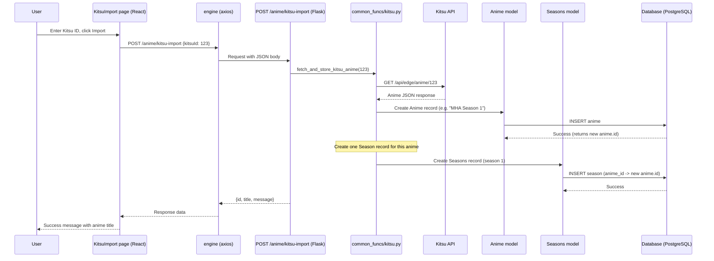

# Design Document

## Overview

This feature adds a Kitsu anime import capability to Open Anime Tracker. A user enters a Kitsu anime ID on a frontend page, the backend fetches the data from the Kitsu API (`https://kitsu.io/api/edge/anime/{id}`), parses it, and stores the anime (and its first season) in the database. The frontend displays success or error feedback. No new database models are needed — the existing `Anime` and `Seasons` models are used.

## Steering Document Alignment

### Technical Standards (tech.md)
No steering docs exist yet. This design follows the existing project patterns:
- Backend uses Flask blueprints (like `routes/anime.py`, `routes/user.py`)
- Frontend uses React + TypeScript + Material-UI (like `Pages/AddAnime.tsx`)
- API calls use the existing `axios` engine from `BackendRequests/base.ts`
- Database session from `database.py`

### Project Structure (structure.md)
No steering docs exist. This design follows the existing project organization:
- New route → `routes/kitsu.py` (alongside `anime.py`, `user.py`, `login.py`)
- New utility → `common_funcs/kitsu.py` (alongside `db_funcs.py`, `login.py`)
- New frontend page → `oat-frontend/src/Pages/KitsuImport.tsx`
- New frontend API helper → `oat-frontend/src/BackendRequests/kitsu.ts`

## Code Reuse Analysis

### Existing Components to Leverage
- **`const.kitsu_api_base` / `const.kitsu_headers`**: Kitsu API configuration already defined in `const.py`
- **`database.session`**: Existing SQLAlchemy session from `database.py`
- **`db_models.anime.Anime`**: Existing model with `__init__` that accepts `title`, `_type`, `status`, plus kwargs (`desc`, etc.)
- **`db_models.seasons.Seasons`**: One season record is created for the imported anime (season 1) to ensure the DB schema handles the data structure properly. Kitsu treats each season as a separate show — this import creates both the anime record and its season record from the same Kitsu API response.
- **`enums.db_enums.AnimeType`, `ReviewStatus`**: Existing enums for type and status
- **`project_exceptions.exceptions.InvalidEnumException`**: Custom exception class already exists
- **`BackendRequests/base.ts` (engine)**: Existing axios instance with `http://localhost:5000` base URL
- **`Pages/AddAnime.tsx`**: Reference for frontend form patterns (InputComponent, SubmitBtn, error display, loading state)
- **`BackendRequests/anime.ts`**: Reference for frontend API call patterns (async function with error handling)

### Integration Points
- **Flask app (`main.py`)**: Register the new `kitsu_routes` blueprint
- **Frontend router (`App.tsx`)**: Add `/kitsu-import` route to the existing React Router setup
- **Auth context**: Use existing `AuthContext` for redirect logic on unauthenticated access

## Architecture



### Modular Design Principles
- **Route file** (`routes/kitsu.py`): Only handles HTTP request/response — validates input, calls service, returns JSON
- **Service file** (`common_funcs/kitsu.py`): Only handles Kitsu API fetching and data parsing — no HTTP concerns
- **Frontend page** (`Pages/KitsuImport.tsx`): Only handles UI state and rendering — delegates to API helper
- **Frontend API helper** (`BackendRequests/kitsu.ts`): Only handles the HTTP request — no UI concerns

## Components and Interfaces

### Component 1: `routes/kitsu.py` (Flask Blueprint)
- **Purpose**: Handle POST requests to import anime from Kitsu
- **Interface**: `POST /anime/kitsu-import` — accepts `{kitsuId: number}` JSON, returns JSON response
- **Dependencies**: `database.session`, `db_models.anime.Anime`, `common_funcs/kitsu`, `project_exceptions`
- **Reuses**: Request validation patterns from `routes/anime.py`, JSON response patterns from `routes/anime.py`

### Component 2: `common_funcs/kitsu.py` (Kitsu API Service)
- **Purpose**: Fetch one anime from Kitsu API, parse its data, and store both the Anime record and one Seasons record (season 1) to validate the DB schema
- **Interface**: `fetch_and_store_kitsu_anime(kitsu_id: int) -> dict` — stores Anime + Seasons record, returns result dict
- **Dependencies**: `requests`, `const.kitsu_api_base`, `const.kitsu_headers`, `database.session`, `db_models.anime.Anime`, `db_models.seasons.Seasons`, `enums.db_enums`
- **Reuses**: `requests.request` from `data_pull.py` (already used for Kitsu calls), `const.kitsu_headers`

### Component 3: `Pages/KitsuImport.tsx` (Frontend Page)
- **Purpose**: Render the Kitsu import form and display results
- **Interface**: Renders an input field, submit button, loading state, success/error message
- **Dependencies**: `React`, `@mui/material`, `react-router-dom`, `BackendRequests/kitsu`, `context/auth_context`
- **Reuses**: Component patterns from `Pages/AddAnime.tsx` (InputComponent, SubmitBtn, error display)

### Component 4: `BackendRequests/kitsu.ts` (Frontend API Helper)
- **Purpose**: Send the import request to the backend
- **Interface**: `kitsuImport(kitsuId: number) => Promise<any>` — calls `POST /anime/kitsu-import`
- **Dependencies**: `BackendRequests/base.ts` (engine), `axios`
- **Reuses**: Error handling pattern from `BackendRequests/anime.ts`

## Data Models

### Kitsu API Response Mapping (Anime)
The Kitsu API returns anime data in this structure (relevant fields only):

```
{
  data: {
    attributes: {
      titles: { en: string, ja_jp: string, ... },
      description: string,
      startDate: string,
      endDate: string,
      episodeCount: number,
      ageRating: string,
      averageRating: string,
      ratingFrequencies: object,
      coverImage: string,
      type: "movie" | "tv",   ← maps to AnimeType
      synopsis: string
    }
  }
}
```

**Mapping to Anime model:**
| Kitsu Field | Anime Field | Notes |
|---|---|---|
| `titles.en` | `title` | Primary title |
| `titles.ja_jp` | `jp_title` | Optional |
| other titles | `other_titles` | Object with non-en/non-ja_jp titles |
| `description` / `synopsis` | `desc` | Description |
| `type` | `_type` | `movie` → `AnimeType.movie`, `tv` → `AnimeType.show` |
| `ageRating` | `content_rating` | Passed through |
| `startDate` | `air_date` | Stored as string |
| `endDate` | `end_date` | Stored as string |
| `episodeCount` | `episodes` | Optional |
| `averageRating` | `rating` | Optional, convert to float |

**Defaults:**
- `_type` = `AnimeType.show` (if type is not recognized)
- `status` = `ReviewStatus.confirmed` (data comes from a trusted API)
- `content_rating` = `PG` (default)

### Kitsu API Response Mapping (Seasons)
Kitsu does **not** group anime into seasons — each season (e.g. "MHA Season 1", "MHA Season 2") is a separate show with its own Kitsu ID. This import tool fetches one Kitsu ID and stores it as both an Anime record and a Seasons record to ensure our DB schema handles all data patterns.

The season data is derived from the same anime response:
- `season_number` = 1 (first season)
- `episodeCount` from Kitsu anime attributes → `Seasons.episodes`
- `description` from Kitsu anime attributes → `Seasons.desc`
- `startDate` from Kitsu anime attributes → `Seasons.air_date`
- `endDate` from Kitsu anime attributes → `Seasons.end_date`
- `type_season` = `SeasonType.SPECIAL` (default)
- `anime_id` = the newly created anime record's ID

## Error Handling

### Error Scenarios
1. **Invalid Kitsu ID (not an integer)**:
   - **Handling**: Return `400` with `{message: "kitsuId must be a valid integer"}`
   - **User Impact**: Error message displayed in the form

2. **Kitsu API returns 404 (anime not found)**:
   - **Handling**: Return `404` with `{message: "Anime not found on Kitsu"}`
   - **User Impact**: Error message displayed in the form

3. **Kitsu API returns malformed data**:
   - **Handling**: Return `400` with `{message: "Invalid anime data from Kitsu"}`
   - **User Impact**: Error message displayed in the form

4. **Database save fails**:
   - **Handling**: Rollback session, return `500` with `{message: "Failed to save anime to database"}`
   - **User Impact**: Generic error message displayed

5. **Kitsu API unreachable**:
   - **Handling**: Catch request exception, return `500` with `{message: "Could not reach Kitsu API"}`
   - **User Impact**: Generic error message displayed

6. **Duplicate anime title already exists**:
   - **Handling**: Return `409` with `{message: "Anime already exists"}`
   - **User Impact**: Conflict error displayed in the form
