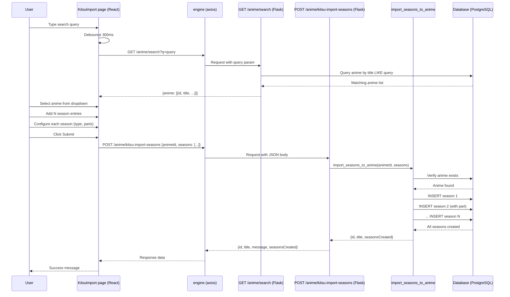

# Design Document

## Overview

This enhancement adds a multi-season import workflow to the existing Kitsu import page. The user first searches for and selects their site anime, then dynamically builds a list of seasons with optional parts and types, and finally submits all seasons to be attached to the selected anime. The backend adds a new endpoint that accepts an anime ID and a list of season objects, creating all seasons in a single transaction.

## Steering Document Alignment

### Technical Standards (tech.md)
- Backend: Flask blueprint pattern (existing `routes/anime.py`, `routes/kitsu.py`)
- Frontend: React + TypeScript + Material-UI (existing `Pages/AddAnime.tsx`, `KitsuImport.tsx`)
- API calls: Existing `axios` engine from `BackendRequests/base.ts`
- Database: SQLAlchemy session from `database.py`, existing `Seasons` model with `part` field
- Enums: `SeasonType` (SEASON, ONA, OVA, SPECIAL) from `enums/db_enums.py`

### Project Structure (structure.md)
- New/modified route → `routes/kitsu.py` (add `POST /anime/kitsu-import-seasons`)
- New/modified service → `common_funcs/kitsu.py` (add `import_seasons_to_anime` function)
- Modified frontend page → `oat-frontend/src/Pages/KitsuImport.tsx` (add search + season builder)
- New frontend API helper function → `oat-frontend/src/BackendRequests/kitsu.ts` (add `importSeasons`)
- New frontend API helper function → `oat-frontend/src/BackendRequests/anime.ts` (add `animeSearch` for debounced search)
- Modified existing route → `routes/anime.py` (add GET endpoint for anime search)

## Code Reuse Analysis

### Existing Components to Leverage
- **`db_models.seasons.Seasons`**: Existing model already has `part` (Integer, nullable), `type_season` (Enum SeasonType), `season_number` (Integer), `anime_id` (ForeignKey) fields — no DB changes needed.
- **`routes/anime.py`**: Existing CRUD patterns — will add a new GET endpoint for anime search using the same blueprint.
- **`routes/kitsu.py`**: Existing blueprint — will add new endpoint to the same blueprint.
- **`common_funcs/kitsu.py`**: Existing service layer — will add `import_seasons_to_anime` function alongside existing `fetch_and_store_kitsu_anime`.
- **`Pages/AddAnime.tsx`**: Reference for form patterns (InputComponent, NumberInputComponent, SelectComponent, CheckBoxComponent, SubmitBtn).
- **`BackendRequests/base.ts`**: Existing axios instance for all API calls.
- **`BackendRequests/kitsu.ts`**: Existing API helper — will extend with new function.
- **`Enums/AnimeType.tsx`**: Existing frontend enums — will add SeasonType enum.
- **`FormComps/SelectComp.tsx`**: Existing select component for season type dropdown.
- **`FormComps/CheckBoxComp.tsx`**: Existing checkbox component for "has parts".
- **`FormComps/NumberInput.tsx`**: Existing number input for part numbers.
- **`FormComps/InputComp.tsx`**: Existing text input for anime search.
- **`database.session`**: Existing SQLAlchemy session for all DB operations.
- **`const.kitsu_api_base`**: Not needed for this feature (only for the original single-import).

### Integration Points
- **`routes/anime.py`**: Add `GET /anime/search?q=<query>` endpoint for frontend anime search.
- **`routes/kitsu.py`**: Add `POST /anime/kitsu-import-seasons` endpoint for multi-season import.
- **Frontend `KitsuImport.tsx`**: Complete rewrite of the page to include search, season builder, and submission.
- **Frontend router `App.tsx`**: No change needed (route already exists at `/kitsu-import`).

## Architecture



### Modular Design Principles
- **Separation of concerns**: Search is handled by `anime.py`, import by `kitsu.py`.
- **Atomic transactions**: All season insertions happen in a single DB transaction (flush + commit).
- **Frontend state management**: Each season entry is an item in an array of objects, managed via React state.

## Components and Interfaces

### Component 1: `routes/anime.py` — Anime Search Endpoint (Modify)
- **Purpose**: Provide debounced search for existing site anime by title.
- **Interface**: `GET /anime/search?q=<string>` — returns JSON list of matching anime.
- **Dependencies**: `database.session`, `db_models.anime.Anime`.
- **Reuses**: `session.query(Anime)` pattern from existing `index()` in this file.
- **Response**: `{anime: [{id, title, _type, ...}]}` with up to 10 results.

### Component 2: `routes/kitsu.py` — Multi-Season Import Endpoint (Modify)
- **Purpose**: Accept anime ID and list of seasons, create all seasons for that anime.
- **Interface**: `POST /anime/kitsu-import-seasons` — accepts `{animeId, seasons: [{seasonNumber, title, episodes, desc, airDate, endDate, typeSeason, part}]}`.
- **Dependencies**: `database.session`, `db_models.anime.Anime`, `db_models.seasons.Seasons`, `common_funcs/kitsu`.
- **Reuses**: Blueprint pattern from existing `kitsu_import()` in this file.
- **Response**: `{id, title, message, seasonsCreated}` on success.

### Component 3: `common_funcs/kitsu.py` — Import Service (Modify)
- **Purpose**: Validate anime exists, create all season records in a single transaction.
- **Interface**: `import_seasons_to_anime(anime_id: int, seasons: list[dict]) -> dict`.
- **Dependencies**: `database.session`, `db_models.anime.Anime`, `db_models.seasons.Seasons`, `enums.db_enums.SeasonType`.
- **Reuses**: `session.flush()` / `session.commit()` pattern from existing `fetch_and_store_kitsu_anime`.
- **Raises**: `ValueError` for invalid anime ID, `RuntimeError` for DB errors.

### Component 4: `KitsuImport.tsx` — Frontend Page (Modify)
- **Purpose**: Full multi-season import form with search, season builder, and submission.
- **Interface**: Renders the enhanced import UI.
- **Dependencies**: React hooks (useState, useCallback, useRef), MUI components, API helpers.
- **Reuses**: Component patterns from `Pages/AddAnime.tsx` (form structure, error display, loading state).
- **State**: `searchQuery`, `searchResults`, `selectedAnime`, `seasons[]`, `error`, `success`, `loading`, `searchLoading`.

### Component 5: `kitsu.ts` — Frontend API Helper (Modify)
- **Purpose**: Export `importSeasons` function for the multi-season import API call.
- **Interface**: `importSeasons(animeId: number, seasons: Season[]): Promise<any>`.
- **Reuses**: Error handling pattern from existing `kitsuImport` in this file.

### Component 6: `anime.ts` — Frontend API Helper (Modify)
- **Purpose**: Export `animeSearch` function for debounced anime search API call.
- **Interface**: `animeSearch(query: string): Promise<any>`.
- **Reuses**: Error handling pattern from existing `animeGet` in this file.

## Data Models

### Frontend Season Entry Interface
```typescript
interface SeasonEntry {
  seasonNumber: number;   // Auto-incremented (1, 2, 3…)
  kitsuId: number;        // The Kitsu anime ID for this specific season
  typeSeason: string;     // 'season' | 'ona' | 'ova' | 'special' (defaults to 'season')
  hasParts: boolean;      // Whether this season is split into parts
  part: number | null;    // Part number (only if hasParts is true)
}
```

### Backend Season Submission Schema
```json
{
  "animeId": 1,
  "seasons": [
    {
      "seasonNumber": 1,
      "kitsuId": 12345,
      "typeSeason": "season",
      "hasParts": false,
      "part": null
    },
    {
      "seasonNumber": 2,
      "kitsuId": 67890,
      "typeSeason": "season",
      "hasParts": true,
      "part": 1
    },
    {
      "seasonNumber": 2,
      "kitsuId": 67891,
      "typeSeason": "season",
      "hasParts": true,
      "part": 2
    }
  ]
}
```

### Design Notes
- The user looks up each season's Kitsu ID directly (e.g., Attack on Titan Season 4 has separate Kitsu IDs for Part 1, Part 2, Part 3).
- `seasonNumber` is the ordinal position (1, 2, 3…) — multiple parts of the same season share the same seasonNumber.
- `typeSeason` maps to the `Seasons.type_season` DB column (required, non-nullable).
- `hasParts` + `part` lets the user mark that a season entry is a split-cour part.
- `kitsuId` is frontend-only metadata — not stored on the `Seasons` model.
- The backend creates a `Seasons` record for each entry, linking it to the selected site anime via `anime_id`. Parts are stored in the existing `Seasons.part` column.

### Search Response Schema
```json
{
  "anime": [
    {
      "id": 1,
      "title": "Attack on Titan",
      "_type": "show",
      "seasons": 4,
      "episodes": 87,
      "desc": "...",
      "status": "confirmed"
    }
  ]
}
```

## Error Handling

### Error Scenarios
1. **No anime selected on submit**: Return user-facing error "Please select an anime from the search results."
2. **No seasons provided**: Return user-facing error "At least one season is required."
3. **Anime ID not found**: Backend returns 404 with message "Anime not found."
4. **Database insert fails**: Rollback all changes, return 500 with generic error.
5. **Search API returns no results**: Frontend displays "No anime found." in the dropdown.
6. **Network error during search/submission**: Frontend displays "Failed to connect. Please try again."

## Testing Strategy

### Unit Testing (Backend)
- Test `import_seasons_to_anime` with valid and invalid inputs.
- Test anime search endpoint returns correct filtered results.
- Test rollback on partial failure scenarios.

### Integration Testing (Frontend)
- Test search debounce behavior (300ms delay).
- Test adding/removing season entries.
- Test "Has Parts" checkbox toggling the part number input.
- Test form validation (missing anime, no seasons).
- Test successful submission displays correct success message.
