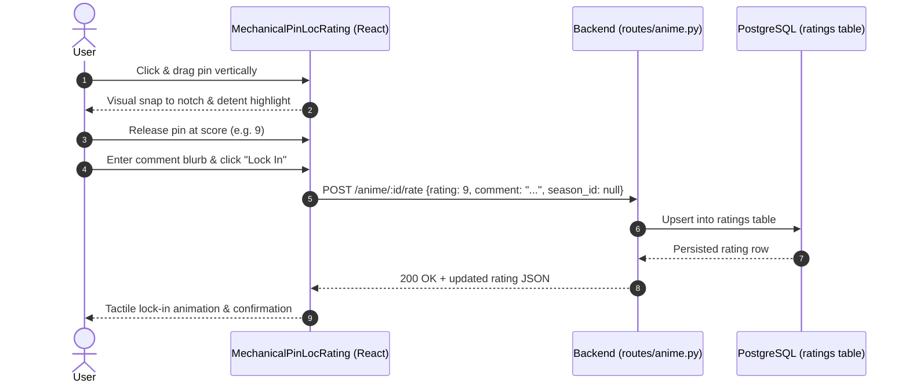

# Design Document: Mechanical Pin Loc Rating UI & Comments

## Overview
This document specifies the technical design for the mechanical pin loc rating vertical scroller and commentary blurb system in Open Anime Tracker. It covers database schema updates, backend API extensions, visual detent snapping, and tactile UI component architecture.

## Steering Document Alignment
### Technical Standards (`tech.md`)
- Backend: SQLAlchemy ORM in `db_models/ratings.py`, business logic in `common_funcs/ratings.py`, blueprint routes in `routes/anime.py`.
- Frontend: TypeScript React functional components with Material-UI and custom CSS styling in `oat-frontend/src/Components/MechanicalRatingScroller/`.
- Migrations: Alembic script in `alembic/versions/`.
- Container Runtime: Podman Compose (`podman compose`).

### Project Structure (`structure.md`)
- Follows existing layout: models in `db_models/`, shared utilities in `common_funcs/`, frontend modules in `oat-frontend/src/`.

## Code Reuse Analysis
### Existing Components to Leverage
- [`db_models/ratings.py`](file:///home/fehr-jensen/repos/open-anime-tracker/db_models/ratings.py): Extends existing `Rating` model.
- [`common_funcs/ratings.py`](file:///home/fehr-jensen/repos/open-anime-tracker/common_funcs/ratings.py): Extends `submit_user_rating` and adds review queries.
- [`routes/anime.py`](file:///home/fehr-jensen/repos/open-anime-tracker/routes/anime.py): Reuses existing `/anime/<id>/rate` route and updates `/anime/<id>` retrieval.
- [`oat-frontend/src/BackendRequests/base.ts`](file:///home/fehr-jensen/repos/open-anime-tracker/oat-frontend/src/BackendRequests/base.ts): Reuses Axios instance configured with credential support.

## Architecture



## Components and Interfaces

### 1. Database Model (`db_models/ratings.py`)
- Column: `comment = Column(String(500), nullable=True)`
- Serializer: `make_json()` returns `id, user_id, rating, anime_id, season_id, comment, created_at, updated_at`.

### 2. Backend Rating Logic (`common_funcs/ratings.py`)
- `submit_user_rating(user_id: int, anime_id: int, rating_value: int, season_id: int | None = None, comment: str | None = None) -> Rating`:
  - Trims comment; raises `ValueError` if length exceeds 500 characters.
  - Updates `comment` on existing row or assigns it to new row.
- `get_anime_reviews(anime_id: int, season_id: int | None = None, limit: int = 20) -> list[dict]`:
  - Joins `Rating` and `User` to return list of reviews with `{ id, username, rating, comment, season_id, created_at }`.

### 3. API Routes (`routes/anime.py`)
- `POST /anime/<anime_id>/rate`: Accepts `{ rating: int, season_id?: int, comment?: str }`.
- `GET /anime/<anime_id>`: Attaches `user_rating` if user is logged in.
- `GET /anime/<anime_id>/reviews`: Returns community reviews for show and seasons.

### 4. Frontend Mechanical Component (`MechanicalPinLocRating.tsx`)
- Props:
  ```typescript
  interface MechanicalPinLocRatingProps {
    animeId: number;
    seasonId?: number | null;
    initialRating?: number | null;
    initialComment?: string | null;
    onRatingSubmitted?: (rating: number, comment?: string) => void;
    compact?: boolean;
  }
  ```
- Detent calculations:
  - 10 detent notches mapped from `y = 0` (top: score 10) to `y = trackHeight` (bottom: score 1).
  - Pointer capture (`e.currentTarget.setPointerCapture(e.pointerId)`) for smooth dragging across the screen.
  - Value snapping: `Math.round(10 - (relativeY / trackHeight) * 9)`.
  - Visual lock: detent circular notch glows when active pin is positioned over it.

### 5. Community Reviews Component (`CommunityReviews.tsx`)
- Fetches and displays reviews with star/badge ratings, user names, formatted dates, and blurbs.

## Error Handling
- Network error on rating submission: Displays in-component alert with retry button.
- Invalid score or oversized comment: Handled client-side (validation preventing submission) and server-side (returns 400 Bad Request).
- Unauthenticated submission: Shows prompt to log in.

